# IconForge 🔥


A modern Next.js application for creating beautiful favicons using Font Awesome icons. Build custom favicons with real-time preview, color customization, and instant download—all in your browser.

## ✨ Features

- 🎨 **Live Preview** - See your favicon in real-time as you customize it (including browser tab!)
- 🎨 **Color Customization** - Choose any color for your icon and background with hex color picker
- 📏 **Size Control** - Adjust icon size with intuitive sliders (10-100%)
- 🔀 **Stacked Icons** - Layer two icons with independent size controls for unique designs
- 🔍 **Fuzzy Search** - Quickly find icons with intelligent Fuse.js-powered search
- 📥 **Multiple Export Formats** - Download as PNG (512x512) or ICO format
- 🚀 **Modern Stack** - Built with Next.js 16, React 19, TypeScript, and Tailwind CSS v4
- 📱 **Responsive Design** - Works seamlessly on desktop and mobile devices

## 🏗️ Architecture Overview

```mermaid
graph TB
    subgraph "User Interface"
        UI["🖥️ Browser"]
    end

    subgraph "Next.js App Router"
        Page["📄 page.tsx<br/>(Main App)"]
        Layout["🎨 layout.tsx<br/>(Font Awesome Setup)"]
    end

    subgraph "Components"
        Canvas["🎨 IconCanvas<br/>(Canvas Rendering)"]
        ColorPick["🎨 ColorPicker<br/>(Color Selection)"]
        Grid["🔲 IconGrid<br/>(Icon Browser)"]
        Size["📏 SizeControls<br/>(Size Sliders)"]
        Download["📥 DownloadControls<br/>(Export Handler)"]
    end

    subgraph "Custom Hooks"
        Search["🔍 useIconSearch<br/>(Fuzzy Search)"]
        DlHook["📥 useDownload<br/>(File Export)"]
        Favicon["🔖 useDynamicFavicon<br/>(Tab Preview)"]
    end

    subgraph "Utilities"
        Icons["📦 icons.ts<br/>(80+ FA Icons)"]
        CanvasUtil["🛠️ canvas-utils.ts<br/>(Drawing Functions)"]
    end

    UI --> Page
    Page --> Layout
    Page --> Canvas
    Page --> ColorPick
    Page --> Grid
    Page --> Size
    Page --> Download

    Page --> Search
    Page --> DlHook
    Page --> Favicon

    Canvas --> CanvasUtil
    Grid --> Icons
    Search --> Icons
    DlHook --> CanvasUtil
    Favicon --> CanvasUtil

    style Page fill:#3b82f6
    style Canvas fill:#8b5cf6
    style Search fill:#10b981
    style Icons fill:#f59e0b
```



## 🛠️ Tech Stack

- **Framework**: Next.js 16 (App Router)
- **Runtime**: React 19
- **Language**: TypeScript 5
- **Styling**: Tailwind CSS v4
- **Icons**: Font Awesome 6 (80+ curated icons)
- **Color Picker**: react-colorful
- **Search**: Fuse.js (fuzzy search)
- **File Handling**: file-saver

## 🧪 Testing

This project includes comprehensive unit tests for components, hooks, and utilities.

```bash
# Run all tests
npm test

# Run tests in watch mode
npm run test:watch

# Generate coverage report
npm run test:coverage
```

See [TESTING.md](./TESTING.md) for detailed testing documentation.

### CI/CD

The project uses GitHub Actions for continuous integration:
- **Linting**: Runs ESLint on every push and PR
- **Testing**: Executes all unit tests with coverage reporting
- **Building**: Verifies the app builds successfully
- **Coverage**: Uploads coverage reports to Codecov

## Getting Started

### Prerequisites

- Node.js 18+
- npm, yarn, or pnpm

### Installation

1. Clone the repository:
```bash
git clone https://github.com/yourusername/iconforge.git
cd iconforge
```

2. Install dependencies:
```bash
npm install
# or
yarn install
# or
pnpm install
```

3. Run the development server:
```bash
npm run dev
# or
yarn dev
# or
pnpm dev
```

4. Open [http://localhost:3000](http://localhost:3000) in your browser

## 🚀 Deployment

This project is optimized for deployment on Vercel.

### Quick Deploy

[](https://vercel.com/new/clone?repository-url=https://github.com/nicholasadamou/iconforge)

### Manual Deployment

1. Push your code to GitHub
2. Import your repository on [Vercel](https://vercel.com/new)
3. Vercel will automatically detect Next.js and configure the build
4. Deploy!

Your app will be live at `https://your-project.vercel.app`

**Automatic deployments:**
- Every push to `main` → Production deployment
- Every pull request → Preview deployment with unique URL

See [DEPLOYMENT.md](./DEPLOYMENT.md) for detailed deployment instructions, custom domain setup, and troubleshooting.

## 🎯 Usage


### Step-by-Step Guide

1. **Search & Select**: Browse the icon grid or use the search bar to find your perfect icon
2. **Customize Colors**:
   - Set icon color using the hex color picker
   - Choose background color or enable transparency
3. **Adjust Size**: Use the slider to control icon size (10-100%)
4. **Stack Icons** (Optional):
   - Enable stacked mode to layer two icons
   - Select a second icon with independent size control
5. **Live Preview**: Watch your favicon update in real-time (including in the browser tab!)
6. **Download**: Export as PNG or ICO format with a single click

## 📁 Project Structure

```
iconforge/
├── app/                      # Next.js App Router
│   ├── layout.tsx           # Root layout with Font Awesome setup
│   ├── page.tsx             # Main application (state management)
│   ├── globals.css          # Global styles & Tailwind directives
│   └── favicon.ico          # Default favicon
├── components/               # React components
│   ├── IconCanvas.tsx       # Canvas-based icon renderer
│   ├── ColorPicker.tsx      # Color selection with hex input
│   ├── IconGrid.tsx         # Searchable icon browser grid
│   ├── SizeControls.tsx     # Icon size sliders (single & stacked)
│   ├── DownloadControls.tsx # Download button with format toggle
│   ├── Header.tsx           # App header
│   └── Footer.tsx           # App footer
├── hooks/                    # Custom React hooks
│   ├── useIconSearch.ts     # Fuzzy search with Fuse.js
│   ├── useDownload.ts       # File download logic (PNG/ICO)
│   └── useDynamicFavicon.ts # Live browser tab favicon update
├── lib/                      # Core utilities
│   ├── icons.ts             # 80+ curated Font Awesome icons
│   └── canvas-utils.ts      # Canvas drawing & export functions
├── types/                    # TypeScript definitions
│   └── icon.ts              # Icon & CanvasState interfaces
└── scripts/
    └── generate-icons.js     # Script to generate icon data
```

## 🔄 Data Flow


## Contributing

Contributions are welcome! Please feel free to submit a Pull Request.

1. Fork the repository
2. Create your feature branch (`git checkout -b feature/AmazingFeature`)
3. Commit your changes (`git commit -m 'Add some AmazingFeature'`)
4. Push to the branch (`git push origin feature/AmazingFeature`)
5. Open a Pull Request

## License

This project is licensed under the MIT License - see the [LICENSE](LICENSE) file for details.

## Acknowledgments

- [Font Awesome](https://fontawesome.com/) for the amazing icon library
- [Next.js](https://nextjs.org/) team for the excellent framework

## Credits

Built with ❤️ using Font Awesome and Next.js
